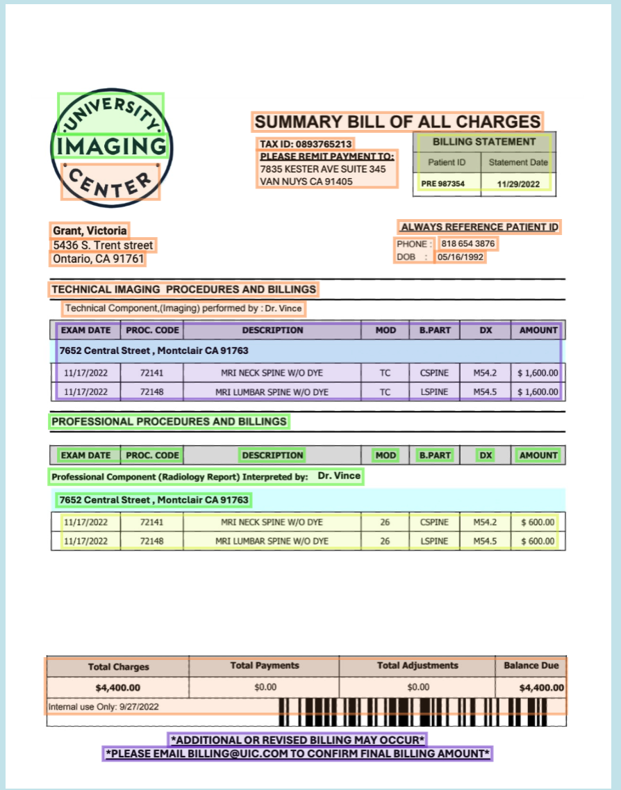

# X-Ray: Document Understanding
## Comprehensive Document Parsing for Modern Applications
In this guide, we'll introduce EyeLevel's X-Ray, a modern parser designed to extract high quality data from complicated real-world documents. X-Ray employs cutting edge parsing techniques which are specifically designed to support modern workflows like RAG, Agents, and Document Summarization, allowing developers to connect data from human-centric documents to LLM powered applications.
## X-Ray in a Nutshell
You can think of X-Ray as a cocktail of document understanding and advanced parsing approaches packaged together under a single API. To give you an idea, these are some of the components which X-Ray employs to understand human-centric documents:

- Bespoke document understanding models to detect key elements within documents.
- Advanced OCR processes which facilitate textual extraction from a variety of document representations.
- A repairing and reformatting pipeline that improves parse interpretability.
- A re-contextualization system that promotes fully contextualized summarizations of parsed results.

The upshot is a system which can extract complete ideas from complex documents, and represent those ideas in a way which is easy for both developers and LLMs to understand.
## See it for yourself
X-Ray's fine tuned vision model is one of the most critical components of the system. Over the last 4 years, EyeLevel has collected a comprehensive set of documents from a variety of domains which have been used to train, in our opinion, the highest quality vision model for understanding complex real-world documents to date. You can use [this demo](https://dashboard.eyelevel.ai/xray) to get an idea of how X-Ray works with your documents.


*An example of X-Ray identifying and extracting key elements from a real-world document.*

Or you can get started with our APIs by following these simple steps:
## How to use X-Ray
### 1) Account Setup
X-Ray exists as a sub-component of a product called GroundX. We won't be using GroundX's core functionality in this article, but we will use GroundX to invoke X-Ray and query the results. Thus, our first step is to set up a GroundX API Key. [First set up an account](https://dashboard.groundx.ai/auth/register), then you can find your API key by navigating to the [API Key page](https://dashboard.groundx.ai/apikey). GroundX has a free trial tier which you can use to experiment with X-Ray.

Once you're set up, install the SDK

:::code

```python
pip install groundx-python-sdk
```

```typescript
npm install groundx-typescript-sdk --save
```

:::

### 2) Creating a Bucket
Once you have a GroundX API key you may wish to create a bucket. Buckets can be used to organize documents into different groupings, which can be useful for certain applications. We can list all available buckets via :api[Bucket_list], and create a new bucket via :api[Bucket_create].

:::code

```python
from groundx import Groundx

# authenticating
groundx = Groundx(
    api_key="XXXX"
)

# creating a new bucket
response = groundx.buckets.create(
  name="parsed_documents_bucket"
)

# storing the bucket_id
bucket_id = response.body["bucket"]['bucketId']
```

```typescript
import { Groundx } from "groundx-typescript-sdk";

// authenticating
const groundx = new Groundx({
  apiKey: "XXXX",
});

// creating a new bucket
const response = await groundx.buckets.create({
  name: "parsed_documents_bucket",
});

// storing the bucket_id
const bucket_id = response.data.bucket.bucketId;
```

:::

### 3) Uploading Documents
Uploading documents to a GroundX bucket will automatically trigger X-Ray. There are a variety of uploading options which might be useful for a variety of use cases. In this example we're uploading a document which is stored locally using :api[Document_ingestLocal].

:::code

```python
response = groundx.documents.ingest_local([{
  "blob": open("sample.pdf", "rb"),
  "metadata": {
    "bucketId": bucket_id,
    "fileName": "sample",
    "fileType": "pdf"
  }
}])
```

```typescript
const response =
  await groundx.documents.ingestLocal([
    {
      blob: fs.readFileSync("sample.pdf"),
      metadata: {
        bucketId: bucket_id,
        fileName: "sample",
        fileType: "pdf",
      },
    },
  ]);
```

:::

### 4) Querying Upload Status
Ingesting returns a `process_id`, which can be used with :api[Document_getProcessingStatusById] to query the progress of the upload. This code checks the status of the process every 10 seconds until ingestion is done.

:::code

```python
process_id = response.body["ingest"]["processId"]

while (True):

    ingest = groundx.documents.get_processing_status_by_id(
        process_id=process_id)
    if (ingest.body["ingest"]["status"] == "complete"):
        break
    if (ingest.body["ingest"]["status"] == "error"):
        raise ValueError('Error Ingesting Document')
```

```typescript 
const process_id = response.data.ingest.processId;
let ingest;

while (true) {
  ingest = await groundx.documents.getProcessingStatusById({
    processId: process_id,
  });
  if (!ingest || !ingest.status || ingest.status != 200 ||
    !ingest.data || !ingest.data.ingest) {
    console.error(ingest);
    throw Error("GroundX ingest request failed");
  }

  if (ingest.data.ingest.status === "complete" || ingest.data.ingest.status === "error") {
    break;
  }

  await new Promise((resolve) => setTimeout(resolve, 3000));
}
```

:::

### 5) Getting X-Ray Results
Now that our documents are fully uploaded we can get all the documents in our bucket via :api[Document_lookup]. We only uploaded a single document, so we can get the one and only document at index `0`, and then get the URL in which the X-Ray output is stored.

:::code

```python
import urllib.request, json 

# Getting parsed documents from the bucket
response = groundx.documents.lookup(
    id=bucket_id
)

# Getting the X-Ray parsing results for one of the documents
xray_url = response.body['documents'][0]['xrayUrl']
with urllib.request.urlopen(xray_url) as url:
    data = json.loads(url.read().decode())
    print(data)
```

```typescript
import axios from 'axios';

// Getting parsed documents from the bucket
const response = await groundx.documents.lookup({
  id: bucket_id,
});

const data = await axios.get(response.data.documents[0].xrayUrl);

print(data)
```

:::

### 6) Interpreting X-Ray Results
X-Ray provides a rich set of results which may be useful in a variety of use cases. Here are some noteworthy outputs of X-Ray:
- **fileKeywords:** A list of keywords which describe the document
- **fileSummary:** A summary of the entire document
- **boundingBoxes:** Key regions within the document which contain meaningful content.
- **contentType:** The type of content a certain chunk is. Textual paragraph, graphical figures, or tables.
- **json:** A reformatted representation of graphs and figures in a json format, useful for both LLM and programatic workflows.
- **narrative:** A reformatted representation of graphs and figures in a narrative format, often useful in LLM applications.
- **sectionSummary:** A contextually summarized representation of a particular section of the document.

This is the full structure of an X-Ray parse:

```json
// Successful lookup response
{
  "fileType": "string", // One of the supported file types, [as described here](https://documentation.groundx.ai/docs/file-types)
  "language": "string", // Language detected on the first page of your document during processing
  "fileKeywords": "string", // Auto-generated comma-delimited list of keywords describing your document
  "fileName": "string", // Name you gave the document when it was uploaded
  "fileSummary": "string", // Auto-generated document summary
  "documentPages": [ // Pages and metadata within the document
    {
      "chunks": [ // Semantic objects found on page, some semantic objects are spread across multiple pages
        {
          "boundingBoxes": [ // Boxes containing semantic object elements
            {
              "bottomRightX": number, // X coordinate for lower right corner of semantic object element
              "bottomRightY": number, // Y coordinate for lower right corner of semantic object element
              "pageNumber": number, // Number of page for semantic object element, starting at 1
              "topLeftX": number, // X coordinate for upper left corner of semantic object element
              "topLeftY": number, // Y coordinate for upper left corner of semantic object element
            }
          ],
          "chunk": number, // Unique integer ID for the semantic object
          "contentType": [ // Types of elements represented within the semantic object
            "string" // "table" | "figure" | "paragraph"
          ],
          "json": [ // Element text, reformatted into JSON format, for "table" and "figure" elements only
            "object" // Auto-generated JSON object describing a section of the information within the "table" or "figure"
          ],
          "multimodalUrl": "string", // Element image, for multimodal processing "table" and "figure" elements only
          "narrative": [ // Element text, reformatted into narrative format, for "table" and "figure" elements only
            "string" // Auto-generated narrative description of a section of the information within the "table" or "figure"
          ],
          "pageNumbers": [ // Pages where semantic object exists
            number // Number of page where semantic object exists
          ],
          "sectionSummary": "string", // Auto-generated section summary for the document section containing the semantic object
          "suggestedText": "string", // Element text, reformatted for LLM completion
          "text": "string" // Element text, extracted and unprocessed
        }
      ],
      "height": number, // Pixel height of page image
      "pageNumber": number, // Number of page, starting at 1
      "pageUrl": "string", // Hosted URL for the page image
      "width": number // Pixel width of page image
    }
  ],
  "sourceUrl": "string", // Hosted URL for your document
}
```