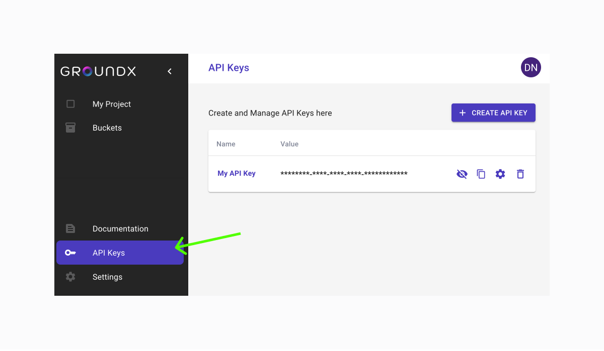
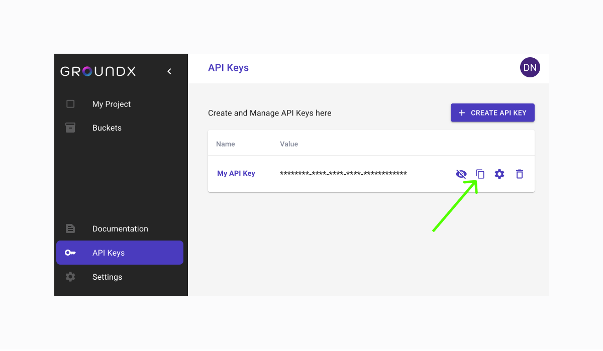

# Quick Start
<iframe width="560" height="315" src="https://www.youtube.com/embed/wH0DR7U0l3c?si=yPkV9ub3OdWx0ZlG" title="YouTube video player" frameborder="0" allow="accelerometer; autoplay; clipboard-write; encrypted-media; gyroscope; picture-in-picture; web-share" allowfullscreen></iframe>

This Quick Start guide is intended to show you how to upload documents and search them using the GroundX APIs. The code within this QuickStart guide can be downloaded from the [code samples GitHub repository](https://github.com/groundxai/code-samples) in [Python](https://github.com/groundxai/code-samples/tree/master/python/getting-started) and [TypeScript](https://github.com/groundxai/code-samples/tree/master/typescript/getting-started).

## Step 1: Download GroundX SDK (optional)

This step is optional. Do this step only if you want to use our [TypeScript](https://github.com/groundxai/groundx-sdks/blob/main/sdks/typescript/README.md) (for javascript and NodeJS projects) or [Python](https://github.com/groundxai/groundx-sdks/blob/main/sdks/python/README.md) SDKs.

Use the following shell commands to install:

:::code

```python
pip install groundx-python-sdk
```

```typescript
npm install groundx-typescript-sdk --save
```

:::

## Step 2: Register and Get Your API Key

Before you can use our APIs, you will need to [create an account](https://dashboard.groundx.ai/auth/register) here.

Log into the [GroundX Dashboard](https://dashboard.groundx.ai) and navigate to API Keys.



Copy your API Key and save it somewhere for use later in this tutorial.



## Step 3: Initialize Your SDK (optional)

If you're using one of our SDKs, you will use your API key to initialize your client:

:::code

```python
from groundx import Groundx, ApiException

groundx = Groundx(
  api_key=groundxKey,
)
```

```typescript
import fs from 'fs';
import { Groundx } from "groundx-typescript-sdk";

const groundx = new Groundx({
  apiKey: groundxKey,
});
```

:::

Replace `groundxKey` with your GroundX API key.

## Step 4: Make Your First Request

All of our API requests require your API Key in the header. Here is an example of how to include it:

:::code

```bash
curl https://api.groundx.ai/api/v1/bucket \
    -H "X-API-KEY: <your_api_key>"
```

```python
try:
  bucket_response = groundx.buckets.list()

  bucketId = bucket_response.body["buckets"][0]["bucketId"]
```

```typescript
const bucketResponse = await groundx.buckets.list();

bucketId = bucketResponse.data.buckets[0].bucketId;
```

:::

For bash requests, replace <your_api_key> with your actual API key.

If your request is successful, you will receive a response that looks something like this:

```json
{
  "buckets": [
    {
      "bucketId": <unique_system_generated_id>,
      "fileCount": <number_of_documents_in_bucket>,
      "fileSize": "<files_size_total>",
      "name": "<your_bucket_name>"
    }
  ],
}
```

This request will return a list of your content buckets where you can upload your documents. Make note of the `bucketId` for use later in this tutorial.

## Step 5: Upload Content

To upload document content, use the [Document Upload API](/reference/Documents/Document_ingestRemote):

:::code

```bash
curl https://api.groundx.ai/api/v1/ingest/documents \
     -X POST \
     -H "X-API-KEY: <your_api_key>" \
     -d '{
           "documents": [
             {
               "bucketId": bucketId,
               "fileType": fileType,
               "sourceUrl": ingestHosted
             }
           ]
         }'
```

```python
# Upload local documents to GroundX

ingest = groundx.documents.ingest_local(
  body=[
    {
      "blob": open(ingestLocal, "rb"),
      "metadata": {
        "bucketId": bucketId,
        "fileName": fileName,
        "fileType": fileType,
      },
    },
  ]
)


# Upload hosted documents to GroundX

ingest = groundx.documents.ingest_remote(
  documents=[
    {
      "bucketId": bucketId,
      "sourceUrl": ingestHosted,
      "fileType": fileType,
    }
  ],
)
```

```typescript
// Upload local documents to GroundX

let ingest = await groundx.documents.ingestLocal([
  {
    blob: fs.readFileSync(ingestLocal),
    metadata: {
      bucketId: bucketId,
      fileName: fileName,
      fileType: fileType,
    },
  }
]);


// Upload hosted documents to GroundX

let ingest = await groundx.documents.ingestRemote({
  documents: [
    {
      bucketId: bucketId,
      fileType: fileType,
      sourceUrl: ingestHosted,
    }
  ]
});
```

:::

Replace `ingestLocal` with the path to your local file, `ingestHosted` to the URL of your hosted file, `fileType` with one of the enumerated file types (e.g. txt, pdf), `fileName` with a name for your file, and `bucketId` with the content bucket you would like to add the document to.

If your request is successful, will receive a response that looks something like this:

```json
{
  "ingest": {
    "processId": "<unique_system_generated_id",
    "status": "<enumerated_status>"
  }
}
```

Make note of `processId`. You will need it in the next step of this Quick Start guide.

## Step 6: Check the Status of Your Upload

Make the following request to query the status of your document upload as it is processed through the GroundX ingestion pipeline:

:::code

```bash
curl https://api.groundx.ai/api/v1/ingest/:processId \
     -H "X-API-KEY: <your_api_key>" \
     -H "Content-Type: application/json"
```

```python
ingest = groundx.documents.get_processing_status_by_id(
  process_id=processId
)
```

```typescript
ingest = await groundx.documents.getProcessingStatusById({
  processId: processId,
});
```

:::

Replace `processId` the processId from the previous step.

If your request is successful, will receive a response that looks something like this:

```json
{
  "ingest": {
    "processId": "<unique_system_generated_id>",
    "progress": {
      "complete": {
        "documents": [
          {
            "documentId": "<unique_system_generated_id>",
            "fileName": "<given_file_name>",
            "fileSize": "<files_size_total>",
            "fileType": "<file_type>",
            "bucketId": <your_bucket_id>,
            "processId": "<unique_system_generated_id>",
            "sourceUrl": "<document_url>",
            "status": "<enumerated_status>"
          }
        ],
        "total": 1
      }
    },
    "status": "<enumerated_status>"
  }
}
```

The value of `status` will be one of `queued`, `processing`, `error`,  or `complete`.

## Step 7: Search Your Content

Make the following request to search your ingested content:

:::code

```bash
curl https://api.groundx.ai/api/v1/search/:id \
     -X POST \
     -H "X-API-KEY: <your_api_key>" \
     -H "Content-Type: application/json" \
     -d '{"query":query}'
```

```python
content_response = groundx.search.content(id=bucketId, query=query)
```

```typescript
const searchResponse = await groundx.search.content({
  id: bucketId,
  query: query,
});
```

:::

You can also use `projectId` or `groupId` in place of `bucketId` in your search query. Any of the 3 values will work for search queries. Replace `query` with the query you want to use to search your content.

If your request is successful, will receive a response that looks something like this:

```json
{
  "search": {
    "count": <int_number_of_results>,
    "query": "<your_query>"
    "score": <float_highest_relevance_score_in_results>,
    "text": "<combined_text_of_search_results>",
    "nextToken": "<token_for_next_set_of_results>",
    "results":[
      {
        "documentId": "<unique_system_generated_id>",
        "score": <float_relevance_score_of_result>,
        "searchData": {
            <document_metadata>
        },
        "sourceUrl": "<source_document_url>",
        "suggestedText": "<rewritten_text_for_LLM_completions>",
        "text":  "<original_text_of_result>"
      }
    ]
  }
}
```

We strongly recommend you use `search.text` for your LLM completions. We provide `search.results` in case you want to create your own context from the search results. If you choose to do this, rather than use `search.text`, we strongly recommend you use `search.results[n].suggestedText` for your context.

If you need to look up a `projectId`, `groupId`, or `bucketId`, you can find them in the [GroundX Dashboard](https://dashboard.groundx.ai) or by querying for them using the APIs.

Make the following request to query for your projects:

:::code

```bash
curl https://api.groundx.ai/api/v1/project \
     -H "X-API-KEY: <your_api_key>"
```

```python
project_response = groundx.project.list()

projectId = project_response.body["projects"][0]["projectId"]
```

```typescript
const projectResponse = await groundx.project.list();

projectId = projResponse.data.projects[0].projectId;
```

:::

If your request is successful, will receive a response that looks something like this:

```json
{
  "projects": [
    {
      "buckets": [
        {
          "bucketId": <unique_system_generated_id>,
          "fileCount": <number_of_documents_in_bucket>,
          "fileSize": "<files_size_total>",
          "name": "<your_bucket_name>"
        }
      ],
      "created": "<project_created_date_time>",
      "fileCount": <number_of_documents_in_project>,
      "fileSize": "<files_size_total>",
      "fileCount": <number_of_documents_in_project>,
      "name": "<your_project_name>",
      "projectId": <unique_system_generated_id>,
      "updated": "<project_updated_date_time>"
    }
  ]
}
```

## Next Steps

Now that you've successfully used the GroundX APIs to upload and search content, you can dive into our [tutorials](/docs/chatgpt) and [documentation](/reference)!

Remember, our APIs are still in closed beta, so we appreciate your patience and feedback as we continue to improve our service.